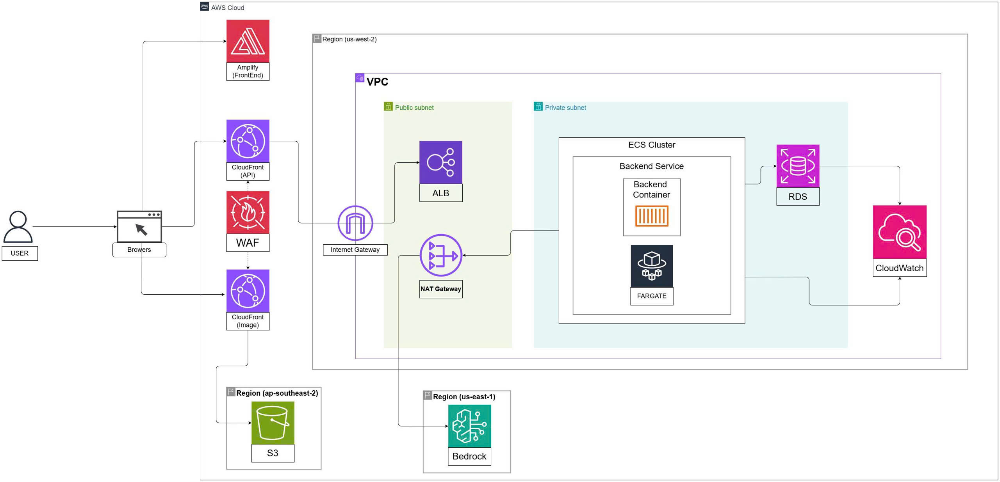

# AI Skincare E-Commerce Platform (AWS Focus)

## 1) Sơ lược project

Đây là hệ thống thương mại điện tử về mỹ phẩm/chăm sóc da, kết hợp:

- Web bán hàng (React + Vite)
- Backend API (Node.js + Express)
- Cơ sở dữ liệu PostgreSQL (Prisma)
- AI chatbot + gợi ý sản phẩm qua Amazon Bedrock
- Upload/quản lý ảnh sản phẩm qua Amazon S3

Mục tiêu chính là xây dựng một nền tảng e-commerce có khả năng mở rộng, bảo mật, tối ưu vận hành trên AWS và sẵn sàng cho các tính năng AI.

## 2) Chức năng tất yếu

- Xác thực và quản lý người dùng: đăng ký, đăng nhập, JWT, Google OAuth, refresh token
- Danh mục/sản phẩm/biến thể: hiển thị, lọc, quản lý tồn kho và giá
- Giỏ hàng và đặt hàng: checkout, theo dõi đơn, hủy đơn, cập nhật trạng thái đơn
- Khuyến mãi: coupon + promotion trên sản phẩm/đơn hàng
- Hồ sơ người dùng: cập nhật thông tin cá nhân và địa chỉ
- Upload file lên S3: phục vụ ảnh sản phẩm/nội dung media
- Chatbot AI: hỏi đáp và đề xuất sản phẩm theo ngữ cảnh
- Quản trị: quản lý khách hàng, đơn hàng, coupon, promotion, category

## 3) AWS Services đang sử dụng

Bảng dưới đây tập trung vào các dịch vụ theo kiến trúc triển khai và dấu vết có trong source code.

| AWS Service | Vai trò trong hệ thống |
| :--- | :--- |
| AWS Amplify | Host frontend (React/Vite), CI/CD cho giao diện |
| Amazon CloudFront (API) | Phân phối luồng API toàn cầu, giảm độ trễ |
| Amazon CloudFront (Image) | CDN cho ảnh/static assets |
| AWS WAF | Lọc request độc hại trước khi vào backend |
| Amazon VPC | Cô lập hạ tầng mạng, chia public/private subnet |
| Internet Gateway | Kết nối public subnet ra Internet |
| NAT Gateway | Cho private subnet outbound an toàn |
| Application Load Balancer (ALB) | Cân bằng tải vào backend service |
| Amazon ECS on Fargate | Chạy container backend không cần quản lý server |
| Amazon RDS (PostgreSQL) | Lưu trữ dữ liệu giao dịch/chức năng nghiệp vụ |
| Amazon S3 | Lưu ảnh và tệp upload |
| Amazon Bedrock | LLM + embeddings cho chatbot/gợi ý |
| Amazon CloudWatch | Log, metric, alarm cho backend và hạ tầng |

## 4) Architecture Diagram

Ghi chú:

- Kiến trúc tách riêng luồng API và luồng image để tối ưu hiệu năng CDN.
- Backend nằm trong private subnet, chỉ ALB nằm ở public subnet.
- Bedrock đặt khác region là mô hình phù hợp với thực tế dịch vụ AI thường được bật ở us-east-1.

## 5) Chi phí AWS ước tính (theo tháng)

Chi phí bên dưới là ước tính để planning (không phải báo giá chính thức), đã bỏ qua thuế và discount Reserved/Savings Plans.

### Giả định tài nguyên

- 1 ALB
- ECS Fargate: 1-2 tasks (0.5 vCPU, 1GB RAM/task)
- RDS PostgreSQL: db.t4g.micro (Single-AZ)
- S3: 100-300 GB
- CloudFront data out: 200-1000 GB
- WAF: 1 Web ACL + 5 rules
- Bedrock sử dụng mức nhẹ đến vừa (chatbot)

### Ước tính tổng

| Nhóm chi phí | Dev/POC | Production nhỏ | Ghi chú |
| :--- | ---: | ---: | :--- |
| Amplify Hosting | 3-8 USD | 10-25 USD | Build + hosting frontend |
| CloudFront (API + Image) | 10-30 USD | 40-120 USD | Phụ thuộc traffic và data out |
| WAF | 10-20 USD | 20-40 USD | ACL + rules + request |
| ALB | 18-30 USD | 25-60 USD | Giờ hoạt động + LCUs |
| ECS Fargate | 15-35 USD | 40-120 USD | Số task + CPU/RAM |
| RDS PostgreSQL | 15-35 USD | 40-120 USD | Instance + storage + backup |
| S3 | 2-8 USD | 10-40 USD | Dung lượng + request |
| NAT Gateway | 35-60 USD | 45-120 USD | Thường là khoản tốn kém lớn |
| CloudWatch | 3-15 USD | 10-40 USD | Logs + metrics + alarms |
| Bedrock | 5-40 USD | 30-300 USD | Tùy thuộc token/model |
| **Tổng ước tính** | **116-281 USD/tháng** | **270-985 USD/tháng** | Biên độ rộng do traffic AI và NAT |

Công thức planning nhanh:

$$
C_{month} \approx \sum_i C_i + C_{traffic} + C_{ai}
$$

## 6) Rủi ro chi phí cần theo dõi sát

- NAT Gateway có thể chiếm tỉ trọng cao nếu outbound lớn.
- CloudFront data transfer tăng nhanh khi image/traffic tăng.
- Bedrock token cost phụ thuộc trực tiếp vào prompt size và số lần gọi model.
- Logs CloudWatch nếu để verbose trong thời gian dài sẽ tăng đáng kể.

## 7) Gợi ý tối ưu chi phí

- Đặt budget + alarm theo service (Billing + CloudWatch Alarms)
- Dùng autoscaling cho ECS theo CPU/RPS
- Tối ưu cache CloudFront và lifecycle policy cho S3
- Giới hạn độ dài prompt và tần suất gọi Bedrock
- Nếu traffic ổn định, cân nhắc Savings Plans cho Fargate/RDS
